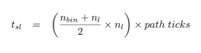

# Optimizing Aircraft Boarding Methods
*Under Professor Cheng Shih-Fen, School of Information Systems, Singapore Management University*

#### Abstract
One major area airlines can improve on to cut costs is through optimization of aircraft boarding methods. Through robust examination of existing methods and comparison with new strategies, this paper attempts to identify the relatively best strategy, using Agent-based Modelling and Simulation. As we strive to make the model as realistic as possible, characteristics of our autonomous agents such as their willingness to follow boarding instructions (compliance) have been simulated. We also try to understand if the number of bags each passenger carry will have a significant impact on total boarding time. Our findings suggest that the Luggage First method is most successful in reducing total boarding time, with relatively high performance and low overhead costs. 

## 1 Introduction
#### 1.1	Background and Importance of Optimizing Aircraft Boarding Strategies

In the airline industry, the phrase “time is money” rings true. Airlines generate revenue only when their planes are utilized and flying passengers. Thus, the longer a plane takes to takeoff means fewer routes it can fly. (Iyigunlu, Fookes, & Yarlagadda, 2014)

But a most common problem – and one of the most challenging ones – plaguing these airline companies is passenger boarding delays. Slow boarding time translates to minutes lost for each plane to depart and thus opportunities to generate profits lost. They cost the US economy on average $32.9 billion a year, and most of it are borne by both passengers and airline companies. 
Thus, there needs to be a more efficient way to minimize the time taken for passengers to board than what was traditionally used. In this project, we attempt to introduce 3 new boarding methods and compare it with an existing and relatively efficient method, the Random Method. 
Since a major reason for passenger boarding delays is the time spent waiting for each passenger in front (of the queue) to put their luggage and sit so that the queue can move forward, our goal will be to minimize this waiting time. 
Through this comparison, we will be able to draw conclusions on the most efficient method, and possibly benefit the airlines industry by proposing a method that is optimized and capable of reducing passenger boarding delays. 
1.2	Agent-based Modelling and Simulation

In order to test the efficacy of our proposed strategies, we will be utilizing Agent-based Modelling and Simulation (ABMS), in an attempt to create a more realistic simulation. The main feature of ABMS is the modeling of individuals as autonomous agents capable of making decisions. (Iyigunlu, Fookes, & Yarlagadda, 2014)

This is most apt for this project as passengers are modelled as agents with the capacity to: 
•	Non-comply with the boarding strategies
•	Have carry-on or choose to go without
•	Have different walking and storing luggage speeds which will affect total boarding time

In summary, plane boarding is not static and there can be no assumption that each person will behave like a robot, executing the same actions as everyone else. There must be a way to introduce the individual characteristics of each person and analyze how such “randomness” will affect the whole boarding time, to better reflect reality.

## 2	Literature Review
#### 2.1 Existing Strategies
There are many research studies on the topic of aircraft boarding methods, but none that are realistically easy to implement and feature low overheads. In fact, the conventional method airlines are still using today, the Back-to-Front method, is actually the worst performing strategy based on research. However, airlines still use them because of its ease of implementation compared to other methods. 
To have a good comparison, we looked at 4 existing strategies (Iyigunlu, Fookes, & Yarlagadda, 2014), mainly: 
1.	Back-to-Front (the Standard Method): Passengers seated at back rows enter first followed by those seated at the middle and the front. 
a.	Pros: Easy to implement. 
b.	Cons: Slow boarding time due to long waiting along the aisle for passengers in front to put their luggage

2.	WILMA: Also known as “Window, Middle, Aisle”, this strategy involves letting passengers seated at the window seat to board first, followed by middle and aisle seat passengers. 
a.	Pros: Easy to implement.
b.	Cons: Unrealistic and results in customer dissatisfaction. For instance, for passengers travelling as a group or family, they may be unwilling to allow their children to board first without them

3.	Random: Passengers are randomly assigned seat numbers and board randomly. 
a.	Pros: Easy to implement and relatively quick boarding time. 
b.	Cons: Easily causes customer dissatisfaction due to inability to choose seats. 

4.	Steffen: Passengers are seated two rows apart in equivalent seats. (E.g. 1A, 3A, 5A)
a.	Pros: Very fast boarding time, probably the most efficient method
b.	Cons: Hard to implement. Especially on a big airplane with 800 over passengers, it may not be realistic to ask passengers to board one-by-one according to seat number. Again, causes separation of groups.

#### 2.2 Proposed Strategies
Although there are quite a few existing strategies, their efficacy still remain uncertain. Hence, this paper will attempt to modify the existing methods and come up with new strategies that are more realistic and easier to implement. 
The three strategies are mainly: 
1. Modified Steffen Method (Mix Random): 
•	Divide passengers into 5 groups 
•	Instead of a single passenger seated 2 rows apart, this method will instead allow a group to board at the same time, in a random pattern. 
2. Modified Steffen Method (Modifications from Existing methods): 
•	Alternating rows of passengers of the left aisle will board first, followed by those from the right aisle. This is to minimize the amount of time each passenger waits for the one in front to finish putting his/her luggage.
> Reference: https://www.youtube.com/watch?v=oAHbLRjF0vo#action=share
Note: This is a proposed method by the YouTube channel CGP Grey. To the best of our knowledge, no study has yet been done on this method.

3. Luggage First Method:
•	Passengers with 2 luggage will board first, followed by 1 and 0 carry-on. The sequence of boarding is random, and this is to ensure those that will take a long time to store their luggage do not result in a long waiting time for those without.
•	To the best of our knowledge, no study has yet been done on these proposed strategies and this paper believes that through the attempt in finding the optimized strategy for aircraft boarding, it will also be able to suggest a more realistic method that is an extension from the original. 
In order to have a fair comparison and a benchmark, we will be comparing the total boarding time taken for our proposed methods against the Random method, which is a relatively efficient and realistic method compared with the rest.

## 3 Hypotheses
The hypotheses that the model created will be attempting to prove are:
1.	Random method will be the worst performing method. Since we are introducing three new strategies that are supposedly more efficient, we are testing to see if this statement is true and that our proposed strategies are better in minimizing total boarding time.

2.	Passengers’ non-compliance with the strategy will influence the outcome of the best strategy. There is a possibility that when passengers do not comply by a method, the overall outcome will change. For instance, at 100% compliance, the Modified Steffen Method may be the most efficient and not be so at differing levels of compliance.

3.	Modified Steffen Method (Extended from Existing) should be the most efficient method. Since this is the only method taken from a published source, we believe there is more credibility in the efficacy of this method and are testing if this is true. 

## 4 Model
#### 4.1 Method 1: Modified Steffen Method (Mix Random)
The Modified Steffen Method (Mix Random) splits passengers into 5 groups and allow each group to board separately, so group 1 will board first before group 2 can board.
The diagram below will illustrate the sequence.

As seen from Figure 1, all passengers are divided into 5 groups. The first group to board is labelled as “1” and the second group as “2” and so on. This method will group passengers assigned to window and middle seats together, separate from aisle seat passengers. Passengers from group 1 - 4 will feature passengers from two consecutive rows, skip two rows, and two consecutive rows again until the end of the row. However, within each boarding group, there is no sequence in the boarding and it is random. The purpose of this method is to separate passengers by rows so that there is more space and time for each boarding passenger to store their luggage.

#### 4.2 Method 2: Modified Steffen Method (Extended from Existing)
This method is different from the first method in terms of the assignment of each passenger to its boarding group. A better illustration is seen below, where the first group to board is labelled as “1” and the last to board is “4”:

As seen from Figure 2, the assignment is for alternating rows instead of differentiating between window, middle and aisle seats, unlike method 1. Within each group, the boarding pattern is random and there is no set sequence (e.g. Wilma). The purpose is to separate passengers of consecutive rows to ensure enough time and space is allocated for each passenger of each row to put their luggage. 

#### 4.3 Method 3: Luggage First Method
This method involves assignment of passengers to groups according to the number of carry-on they have, as illustrated by the table here: 

| Number of Carry On | Group Number |
|--------------------|--------------|
| 2 luggage          | 1            |
| 1 luggage          | 2            |
| 0 luggage          | 3            |

## 5 Parameters used & Actual Implementation
There are mainly 9 parameters used. In the actual implementation, we allowed the option of turning “WILMA” and “Back-to-Front” on/off for Methods 1 and 2 (Modified Steffen). 
As seen below, in the actual NetLogo model, we randomly assigned passengers to a particular seat and generate the number of carry-on they have based on empirical distribution data.

| Parameter                          | Value                               | Justification                                                                                        |
|------------------------------------|-------------------------------------|------------------------------------------------------------------------------------------------------|
| Plane occupancy                    | 100%                                | Maximum capacity of the plane, i.e. yielding the worst waiting time                                  |
| % of people who dont follow rule  | 0%, 33%, 66%                        | Based on research papers on most optimal level to test (Audenaert, Verbeeck, & Berghe, 2009)         |
| % of passengers with 1 bag, 2 bags | 0 bag: 45%, 1 bag: 40%, 2 bags: 15% | Based on actual empirical distribution of passengers carrying bags onboard (Steiner & Philipp, 2009) |
| Luggage Storing Time               | Formula                             | Formula taken from (Audenaert, Verbeeck, & Berghe, 2009)                                             |
| Time required to move to seat      | 7s                                  | Average time taken from (Qiang, Jia, & Huang, 2017)                                                  |
| Type of Boarding Method            | WILMA, Back-to-Front                | Most common methods used for Steffen Method|

In the above table, we set the value for 1) Plane Occupancy at 100% in order to yield the “worst outcome” or the maximum capacity. This is a slider in NetLogo and flexible for changes by any user. For 2) the percentage of people who are non-compliant, we used the values 0%, 33% and 66% as indicated by various research papers (Audenaert, Verbeeck, & Berghe, 2009). 3) Luggage distribution, we found empirical distribution data from (Steiner & Philipp, 2009) and found that most passengers are likely to have 1 to 2 bags. 4) Luggage storing time, we used a formula (Audenaert, Verbeeck, & Berghe, 2009) to calculate the total time taken for each passenger: 
 
 
 
5)Time required to move to seat, we used the average time calculated which is 7 seconds as the value (Qiang, Jia, & Huang, 2017). There was insufficient data available on actual distribution and we had to approximate for this parameter. 

Lastly, for the type of boarding method, since the original Steffen Method (Iyigunlu, Fookes, & Yarlagadda, 2014) requires each passenger to board according to WILMA and back-to-front, which is highly unrealistic as it forces groups to separate and in particular, families to separate for a short while, this method can cause a lot of customer dissatisfaction and may not be feasible to implement in real life. Hence, we allowed the option for users to toggle it on/off depending on the situation they want to simulate. 
## 6 Results
#### 6.1 Effects of Non-compliance on the model
We tested our model using 100 experiments with differing levels of non-compliance, at mainly 0%, 33% and 66% as these values were the recommended guidelines (Audenaert, Verbeeck, & Berghe, 2009) with 66% of the passengers carrying 1 or 2 bags.

As seen from Figure 4, different levels of non-compliance does not appear to have a significant impact on the total boarding time. However, for the Luggage First method, the greater the non-compliance, the greater the total boarding time. Given that the Luggage First method is still significantly more efficient than the rest of the methods, as seen from its total boarding time even under three varying degrees of non-compliance, this means that even when there are passengers who do not comply by the rules in real life, its effects is minimal and this strategy is able to handle even such behavior. Hence, Luggage First method appears to be a comparably better strategy in this scenario. 

#### 6.2 Effects of Luggage Distribution on the model
100 experiments with differing luggage distribution at mainly 0%, 33% and 66% of passengers with 1 or 2 bags were tested.

Differing levels of luggage distribution does have a significant impact on total boarding time. In fact, amount of time taken increases with increasing number of bags. This is because time taken to store bags will increase the total boarding time. Thus, when there is 0% bags, the total boarding time is minimized. While both modified steffen methods are only marginally different from the benchmark, the Random Method, the Luggage First method still outperform all 3 other methods even with varying levels of luggage distribution. Although the Luggage First method may fare worse than the others when there is 0% passengers with bags, its total boarding time is only slightly worse off.

Hence, the Luggage First method can be said to be comparably more efficient even when tested under different conditions of luggage distribution.

## 7 Validation of Model
All parameters used in this model are values validated by various research papers. We want to thank the various authors who have made this work possible with their stochastic field work done on various aircraft boarding strategies, especially Michael Schultz with his paper on “Field Trial Measurements to Validate a Stochastic Aircraft Boarding Model.

## 8 Conclusion
The purpose of this paper was to test if there are more efficient aircraft boarding strategies than what is currently used in the industry. Our hypotheses were:
1.	Random method will be the worst performing method. However, we were proven wrong as our Modified Steffen Methods did not fare comparably better than the benchmark.
2.	Passengers’ non-compliance with the strategy will influence the outcome of the best strategy. To our surprise, non-compliance does not appear to be a strong factor in influencing total boarding time as even under different levels of non-compliance, there was no significant differences in total boarding time for all 4 methods including the benchmark. 
3.	Modified Steffen Method (Extended from Existing) should be the most efficient method. Since this was a method taken from a published source, we believed that it would outperform all our methods. Instead, the Luggage First method was more efficient and perhaps more realistic as it stood the test of time even when pitted against different levels of non-compliance and luggage distribution. 
In conclusion, this paper has proven that there are more efficient methods (Luggage First Method) than the current benchmark, which is the Random Method, and this could potentially impact airline industry by helping to reduce total boarding time and allow savings on passenger boarding delays. Airplanes could depart earlier and enjoy time savings at low overhead costs as the Luggage First method is relatively easy to implement. Implementation would at most involve passengers declaring the number of carry-ons they have when checking in, which is very simple considering today’s technology. Such declaration could easily take place over an app or a website. 
All in all, there are many areas for optimization in the airlines industry, and this requires more prudent analysis and introduction of strategies that are realistic and easy to implement.

## References
- Audenaert, J., Verbeeck, K., & Berghe, G. V. (2009). Multi-Agent Based Simulation for Boarding. KU Leuven.
- Iyigunlu, S., Fookes, C., & Yarlagadda, P. (2014). Agent-based Modelling of Aircraft Boarding Methods . Brisbane: Queensland University of Technology.
- Qiang, S., Jia, B., & Huang, Q. (2017). Evaluation of Airplane Boarding/Deboarding Strategies: A Surrogate Experimental Test.
- Steiner, A., & Philipp, M. (2009). Speeding up the airplane boarding process by using pre-boarding areas. Swiss Transport Research Conference (STRC) 2009. Ascona, Switzerland.

